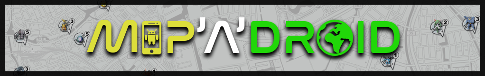
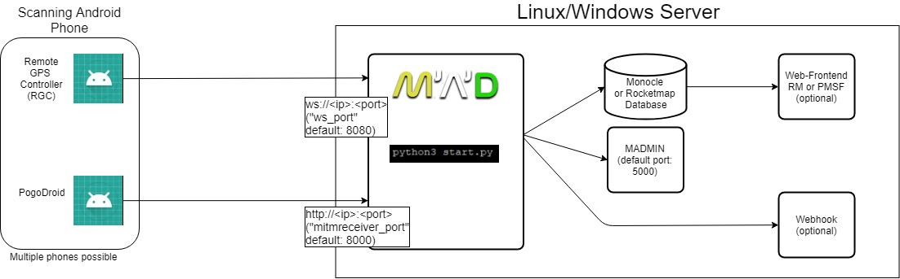

# Map'A'Droid




Map'A'Droid is a Raid & Pokémon scanner for Pokémon GO, based on Android devices.

## Information
* [Website](https://www.maddev.de/) - For general information
* [Discord](https://discord.gg/7TT58jU) - For general support
*  [Github Issues](https://github.com/Map-A-Droid/MAD/issues) - For reporting bugs (not for support!)

## Requirements
- Python **3.6**
- MySQL database, with RocketMap or Monocle structure
- Rooted Android device
- PogoDroid token (only necessary for MITM Mode), obtainable [via Patreon](https://www.patreon.com/user?u=14159560)

>MAD is compatible with [this Monocle schema](https://github.com/whitewillem/PMSF/blob/master/cleandb.sql) and [this RocketMap fork](https://github.com/cecpk/OSM-Rocketmap). Please use them or change your database accordingly.

## Setup
### Ubuntu/Debian

Install `python 3.6` & `pip3` according to docs for your platform. Make sure you carefully check the command, since even if python3.6 is installed, the `python3` command could still point to `python3.5` or below!

Once Python is installed, ensure that `pip` and `python` is installed correctly by running:
* `python3 --version` - should return `3.6.x`
* `pip3 --version` - If it returns a version, it is working.

Clone this repository:
```bash
git clone https://github.com/Map-A-Droid/MAD.git
```

Make sure you're in the directory of MAD and run:
```bash
pip3 install -r requirements.txt
```
If you want to use OCR to scan raids, run with `requirements_ocr.txt` and install additional packages: `apt-get install tesseract-ocr python-opencv`


## MAD concept


**RGC (Remote GPS Controller)** is responsible for receiving the GPS commands from your server, taking screenshots (if OCR is enabled) and managing Pokémon Go on the phone (restarting, detecting if POGO is opened, etc)

**PogoDroid** is the MITM (Man in the middle) App for reading the data from Pokémon Go and send it to your server. If you use the OCR method, you don’t need this app.

## Configuration
Inside the `config` folder, duplicate the `config.ini.example` and rename it to `config.ini`. Then populate it with at least the database and websocket configurations.

### Mappings.json
In order to map devices to areas, do the same with `mappings_example.json` and rename it to `mappings.json`
Refer to mappings_example.json for examples or run `python3 start.py -wm` and open the MADMIN mappings editor (http://localhost:5000).

#### IV
MAD can scan for IVs with two different modes: `iv_mitm` scans already scanned Pokémon specified by `mon_ids_iv`. A typical usecase is to just IV check rare spawns with it. The second mode is `mon_mitm`. That is just like regular Pokémon scanning but every encounter defined in `mon_ids_iv` gets IV checked automatically with the same scanner - one encounter per location. Every other config parameter is explained in MADmin. 

### Geofence
Each area *requires* `geofence_included`. A geofence can easily be created with [geo.jesparke.net](http://geo.jasparke.net/)
> A geofence requires a name: `[geofence name]` with `lat, lng` per line, no empty lines at the end of file  

## Phone Setup
#### Rooting
1. Ensure your phone has an unlocked bootloader and is able to support root. [Lineage OS](https://lineageos.org/) is a good place to start for a custom ROM and they have good installation instruction for each device.  
2. Install [Magisk](https://www.xda-developers.com/how-to-install-magisk/) to root the phone via recovery. Repackage the MagiskManager App and add Pokémon Go to Magisk Hide. Make sure to delete the folder `/sdcard/MagiskManager` after repackaging.
>It's necessary to pass the Safetynet check to run Pokémon Go on rooted phones. Check the Safetynet status in the MagiskManager App.

#### Applications
Install [RGC (Remote GPS Controller)](https://github.com/Map-A-Droid/MAD/blob/master/APK/RemoteGpsController.apk) and [PogoDroid](https://www.maddev.de/apk/PogoDroid.apk) (only necessary for MITM mode) on the phone. RGC must be installed as a system app. Best practice is to convert it to a system app with [link2sd](https://play.google.com/store/apps/details?id=com.buak.Link2SD).
Both apps require an Origin header field that's configured in mappings.json. These Origins need to be unique per running python instance.
The websocket URI for RGC is `ws://<ip>:<port>` and the POST destination for PogoDroid is `http://<ip>:<port>`.
>The port for RGC is 8080 by default and can be changed with `ws_port`.
>The port for PogoDroid is 8000 by default and can be changed with `mitmreceiver_port`.

>**The IP address is the IP of your server, not your phone!**


To login into PogoDroid, you need a token. You can obtain a token by clicking on `Get Token` in PogoDroid and sending the command `!settoken <your_token>` to the MAD Discord Bot. This will only work if you're a [Patreon supporter](https://www.patreon.com/user?u=14159560) and linked your account to Discord.

#### Rubberbanding
If you are experiencing weird and quick GPS jumps to the actual location from the phone, you can try these steps to fix it.

**Keep in mind that any of these possible fixes can cause boot loops or crashes. Please create a backup of your phone, if you don't want to start over.**

 - Use tinfoil around your phone (seriously)
 - Enable GMS reset
 - Disable Google Play Services background data
 - Set the device to GPS only
 - Disable Wi-Fi location (same settings tab as GPS)
 - Try flightmode with only Wi-Fi enabled
 - Disable FusedLocation inside Google Play Services via [Service Disabler](https://play.google.com/store/apps/details?id=com.kunkunsoft.rootservicedisabler)

## Launching MAD
Make sure you're in the directory of MAD and run:
```bash
python3 start.py
```

Usually, you want to append `-wm` and `-os` as arguments to start madmin (browser-based monitoring) and the scanner (`-os`) responsible for controlling devices and receiving data from Pogodroid (if OCR enabled, also take screenshots).

If you want to run OCR on screenshots, run `-oo` to analyse screenshots

## MADMIN
MADMIN is a web frontend to configure MAD to your needs, see the current position of your devices, fix OCR failures. You can enable it with `with_madmin` in the config file or `-wm` as a command line argument. The default port is 5000. See the config.ini.example for more options.

## Tools
To make your life easier you can use the scripts in `scripts/`.

### Spawnpoint Importer (import_allspawns.sh)
If you used to scan before and happen to still have your spawnpoints in your Monocle or Rocketmap database then you can use this script to import them to MAD. You must have the trs_spawn table already in your database and you must have filled out the Database portion of the MAD config file!

### Intel Importer (intelimport.sh)
If you ran the MITM method for the first time, you will probably notice that all gyms are missing names and pictures. If you want to add this information, you can use this script. First of all, you'll need a CSV Export from the  [Ingress Intel Map](https://intel.ingress.com/intel). Install [IITC](https://iitc.me/) and the `IntelCsvExporterMADedition.js`
 in the scripts directory. Make sure to scrape all the necessary portals in your area and export the CSV file to your server. The second step is to run the script with the csv file as the first parameter.  
Example: `./intelimport.sh export.csv`.

## Security
RGC and PogoDroid both support wss/HTTPS respectively. Thus you can setup reverse proxies for MAD. The Auth headers in RGC and Pogodroid both use Basic auth. This means the password/username is not encrypted per default, that's to be done by SSL/TLS (wss, HTTPS).
